# Casos de uso y diagramas solicitados (IA Security)

Este documento lista únicamente los casos de uso core solicitados. Cada CU incluye un diagrama de robustez propio y, para cada núcleo, se mantienen los diagramas consolidados de casos de uso y robustez.

## CORE 1 — IA Security Actions PDF

### Casos de uso

#### CU-001-001: Evaluación de riesgo por sesión de visualización
Calcula el `SuspicionScore` 0–1 combinando capturas, impresiones, copias, cambios rápidos de página, eventos de portapapeles, blur/visibilidad, salidas de fullscreen, lectura anómala y tiempo por página.

**Diagrama de caso de uso (CU-001-001)**
```plantuml
@startuml
left to right direction
actor Usuario
rectangle "IA Security Actions PDF" {
  usecase "Evaluar riesgo\npor sesión" as UC1001
}
Usuario --> UC1001
UC1001 : Captura/copiar/imprimir
UC1001 : Blur/visibility/fullscreen
UC1001 : Lectura anómala + tiempo por página
@enduml
```

**Diagrama de robustez (CU-001-001)**
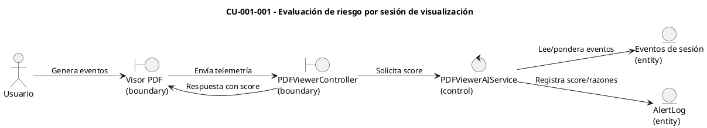

#### CU-002-002: Integración con riesgo histórico
Inyecta el `RiskScore` del usuario y aplica un bono por anomalías previas para reforzar perfiles riesgosos.

**Diagrama de caso de uso (CU-002-002)**
```plantuml
@startuml
left to right direction
actor "Analista de seguridad" as Analyst
actor "Motor de scoring" as Engine
rectangle "IA Security Actions PDF" {
  usecase "Integrar RiskScore\nen visor" as UC1002
}
Analyst --> UC1002
Engine --> UC1002
UC1002 : Leer RiskScore histórico
UC1002 : Aplicar bono por anomalías
UC1002 : Enriquecer SuspicionScore
@enduml
```

**Diagrama de robustez (CU-002-002)**
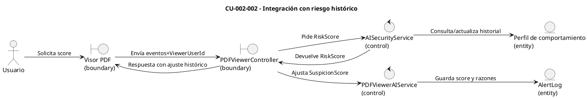

#### CU-003-003: Reputación de IP y tasa de acciones sospechosas
Sube el score si la IP cambia respecto de accesos previos o si la tasa de screenshot/copiar/imprimir supera el umbral por minuto.

**Diagrama de caso de uso (CU-003-003)**
```plantuml
@startuml
left to right direction
actor Usuario
actor "Sistema de reputación" as Reputation
rectangle "IA Security Actions PDF" {
  usecase "Ajustar score por IP\ny tasa sospechosa" as UC1003
}
Usuario --> UC1003
Reputation --> UC1003
UC1003 : Comparar IP vs. histórico
UC1003 : Calcular tasa acciones/min
UC1003 : Ajustar SuspicionScore
@enduml
```

**Diagrama de robustez (CU-003-003)**
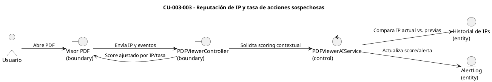

#### CU-004-004: Secuencia extremo a extremo de scoring
Flujo Usuario → UI → API → servicio de scoring → análisis de comportamiento → respuesta con score y recomendaciones.

**Diagrama de caso de uso (CU-004-004)**
```plantuml
@startuml
left to right direction
actor Usuario
actor "Analista de seguridad" as Analyst
rectangle "IA Security Actions PDF" {
  usecase "Orquestar scoring\nend-to-end" as UC1004
}
Usuario --> UC1004
Analyst --> UC1004
UC1004 : UI → API → Servicio AI
UC1004 : Integrar RiskScore + IP
UC1004 : Devolver score + recomendaciones
@enduml
```

**Diagrama de robustez (CU-004-004)**
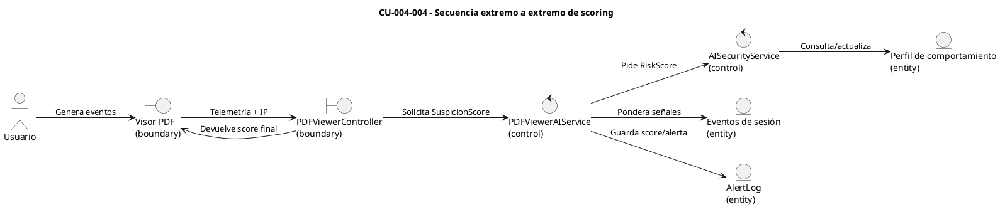

### Diagramas de contexto (CORE 1)
**Pertenece a:** IA Security Actions PDF

Diagrama de casos de uso consolidado:
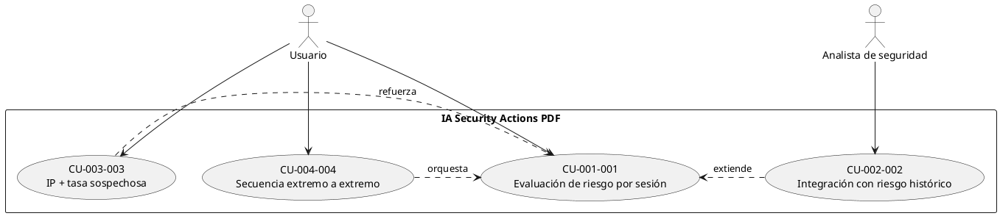

Diagrama de robustez consolidado:
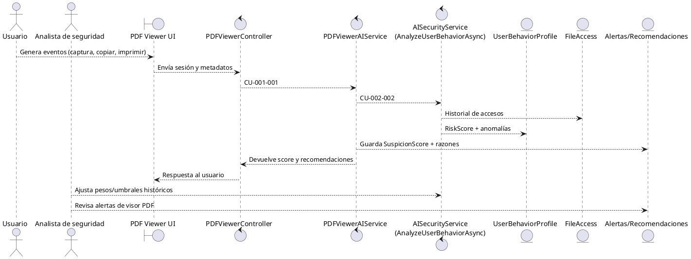

## CORE 2 — Gestión AI-Agent Security Dashboard

### Casos de uso

#### CU-005-005: Cálculo de threat score por archivo
Combina señales directas del archivo y contexto de subida antes de almacenarlo.

**Diagrama de caso de uso (CU-005-005)**
```plantuml
@startuml
left to right direction
actor Usuario
rectangle "AI-Agent Security Dashboard" {
  usecase "Calcular threat score\npor archivo" as UC5005
}
Usuario --> UC5005
UC5005 : Extensión / tamaño / horario
UC5005 : Probabilidad malware / exfiltración
UC5005 : Decisión permitir/alertar
@enduml
```

**Diagrama de robustez (CU-005-005)**
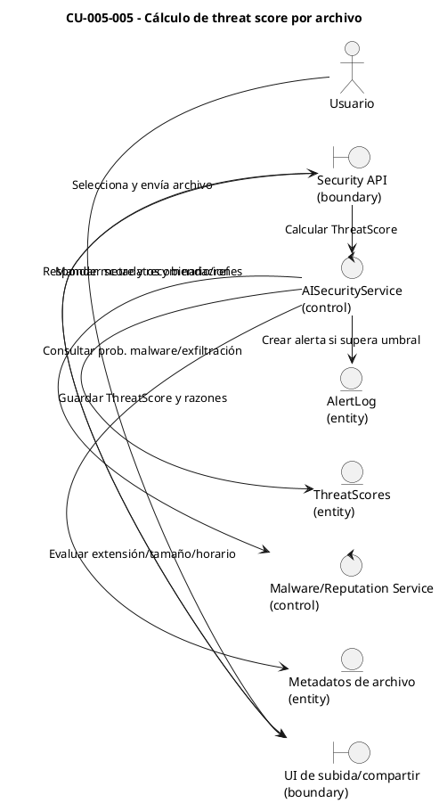

#### CU-006-006: Riesgo de comportamiento del usuario
Deriva `RiskScore` continuo con anomalías de ubicación, dispositivo, horario y accesos fallidos.

**Diagrama de caso de uso (CU-006-006)**
```plantuml
@startuml
left to right direction
actor Usuario
actor "Analista de seguridad" as Analyst
rectangle "AI-Agent Security Dashboard" {
  usecase "Calcular RiskScore\nde usuario" as UC6006
}
Usuario --> UC6006
Analyst --> UC6006
UC6006 : Ubicación/dispositivo dominante
UC6006 : Spikes de accesos fallidos
UC6006 : Horarios atípicos + rareza
@enduml
```

**Diagrama de robustez (CU-006-006)**
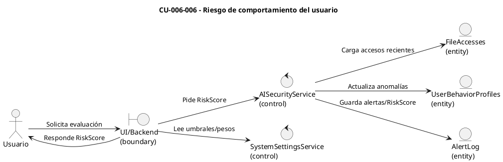

#### CU-007-007: Proyección en AI Security Dashboard
Usa `RiskScore`, alertas y `FileScanResult` para métricas, tendencias y recomendaciones.

**Diagrama de caso de uso (CU-007-007)**
```plantuml
@startuml
left to right direction
actor "Analista de seguridad" as Analyst
rectangle "AI-Agent Security Dashboard" {
  usecase "Proyectar métricas\ny tendencias" as UC7007
}
Analyst --> UC7007
UC7007 : KPIs diarios y severidad
UC7007 : Top usuarios/archivos riesgosos
UC7007 : Recomendaciones accionables
@enduml
```

**Diagrama de robustez (CU-007-007)**
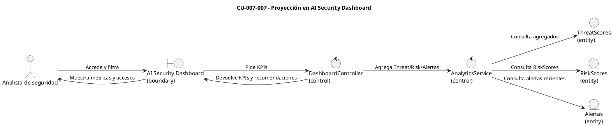

#### CU-008-008: Umbrales y decisiones operativas
Aplica umbrales para marcar alertas y guiar monitoreo, revisión o bloqueo.

**Diagrama de caso de uso (CU-008-008)**
```plantuml
@startuml
left to right direction
actor "Analista de seguridad" as Analyst
rectangle "AI-Agent Security Dashboard" {
  usecase "Aplicar umbrales\ny acciones" as UC8008
}
Analyst --> UC8008
UC8008 : Thresholds Suspicious/HighRisk
UC8008 : Generar/severidad de alertas
UC8008 : Recomendar acción operativa
@enduml
```

**Diagrama de robustez (CU-008-008)**
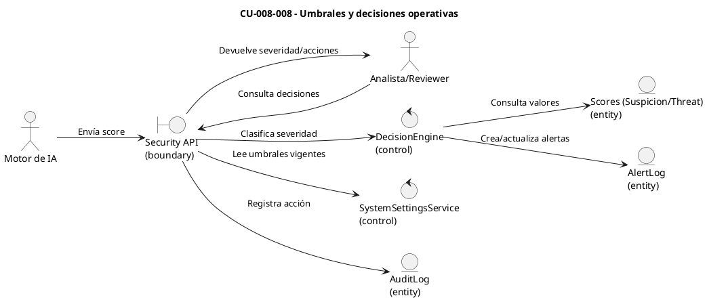

#### CU-009-009: Flujo de revisión y bloqueo manual
Permite al revisor confirmar `blockuser`, auditando la decisión.

**Diagrama de caso de uso (CU-009-009)**
```plantuml
@startuml
left to right direction
actor "Analista de seguridad" as Analyst
rectangle "AI-Agent Security Dashboard" {
  usecase "Revisar y bloquear\nusuario" as UC9009
}
Analyst --> UC9009
UC9009 : Consultar alerta crítica
UC9009 : Evaluar evidencias y RiskScore
UC9009 : Confirmar blockuser + auditoría
@enduml
```

**Diagrama de robustez (CU-009-009)**
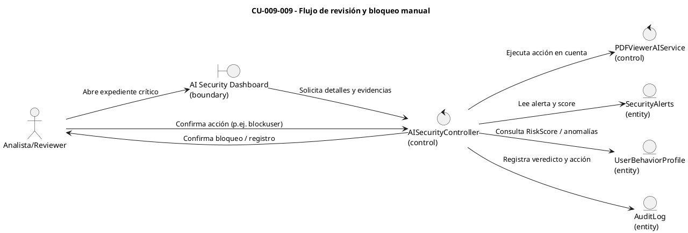

### Diagramas de contexto (CORE 2)
**Pertenece a:** Gestión AI-Agent Security Dashboard

Diagrama de casos de uso consolidado:
```plantuml
@startuml
actor "Usuario" as User
actor "Analista de seguridad" as Analyst

rectangle "AI-Agent Security Dashboard" as System {
  usecase "CU-005-005\nThreat score por archivo" as UC10
  usecase "CU-006-006\nRiesgo de comportamiento" as UC11
  usecase "CU-007-007\nProyección en dashboard" as UC12
  usecase "CU-008-008\nUmbrales y decisiones" as UC13
  usecase "CU-009-009\nRevisión y bloqueo manual" as UC14
}

User --> UC10
User --> UC11
User --> UC13
Analyst --> UC12
Analyst --> UC14
UC11 .> UC10 : «alimenta RiskScore»
UC10 .> UC12 : «puebla dashboard»
UC13 .> UC12 : «define severidad»
UC14 .> UC13 : «ejecuta decisión»
@enduml
```

Diagrama de robustez consolidado:
```plantuml
@startuml
actor "Usuario" as User
actor "Analista de seguridad" as Analyst
boundary "File Upload UI" as UploadUI
control "UploadController" as UploadCtrl
control "AISecurityService" as AISec
control "AISecurityController\n(review)" as ReviewCtrl
entity "FileScanResult" as Scan
entity "SecurityAlert" as Alert
entity "UserBehaviorProfile" as Profile
entity "FileAccess" as Access

User --> UploadUI : Sube archivo
UploadUI --> UploadCtrl : CU-005-005
UploadCtrl --> AISec : Calcula threat score
AISec --> Access : Historial y dispositivos
AISec --> Profile : CU-006-006
AISec --> Scan : Guarda threatScore + flags
AISec --> Alert : Crea alerta (CU-008-008)
UploadCtrl --> UploadUI : Decisión y recomendación

Analyst --> ReviewCtrl : CU-009-009
ReviewCtrl --> Alert : Lee alerta pendiente
ReviewCtrl --> Profile : Revisa RiskScore + anomalías
ReviewCtrl --> Alert : Actualiza estado/veredicto
ReviewCtrl --> Scan : Audita evidencia usada
@enduml
```
