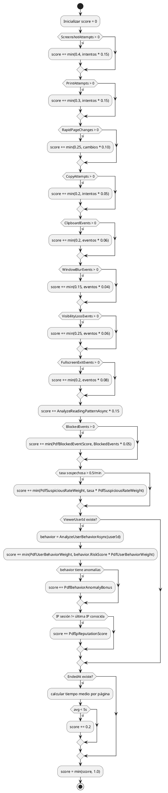
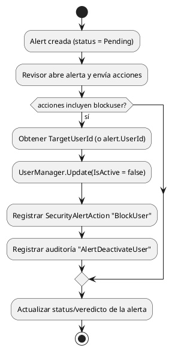
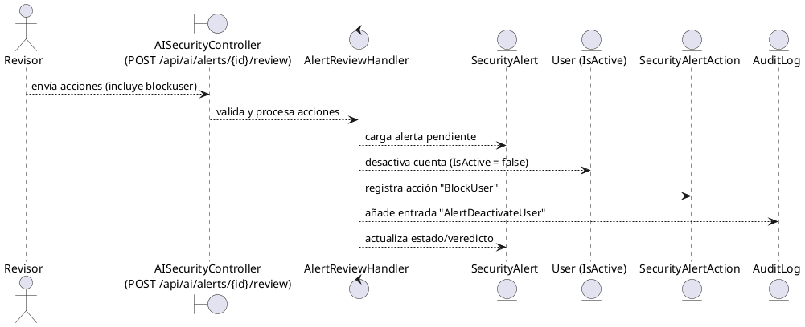
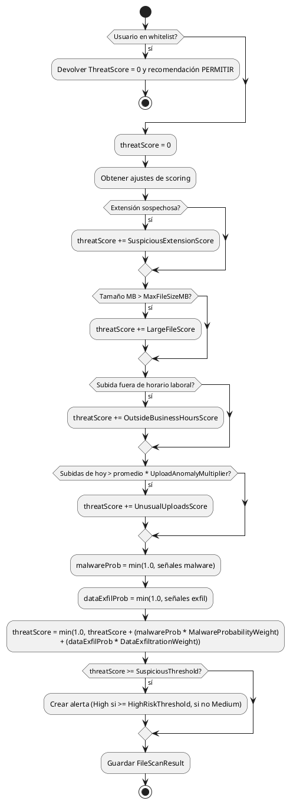

# Caso de uso core #1: scoring de la IA en el visor de PDF

Este sistema calcula un **suspicion score** (0 a 1) para cada sesión de visualización de PDF. El cálculo vive en `PDFViewerAIService.CalculateSuspicionScoreAsync` y combina varios factores de comportamiento observados en la sesión.

## Factores y pesos
- **Intentos de captura de pantalla** (`ScreenshotAttempts`): hasta 0.40 del puntaje, sumando 0.15 por intento.
- **Intentos de impresión** (`PrintAttempts`): hasta 0.30 del puntaje, sumando 0.15 por intento.
- **Cambios rápidos de página** (`RapidPageChanges`): hasta 0.25, con 0.10 por cambio rápido detectado.
- **Intentos de copiar texto** (`CopyAttempts`): hasta 0.20, con 0.05 por intento.
- **Eventos de portapapeles** (`ClipboardEvents`): hasta 0.20, con 0.06 por evento.
- **Eventos de desenfoque de ventana** (`WindowBlurEvents`): hasta 0.15, con 0.04 por evento.
- **Pérdida de visibilidad de la pestaña** (`VisibilityLossEvents`): hasta 0.25, con 0.06 por evento.
- **Salir de pantalla completa** (`FullscreenExitEvents`): hasta 0.20, con 0.08 por evento.
- **Patrón de lectura anómalo** (`AnalyzeReadingPatternAsync`): el puntaje que devuelve se multiplica por 0.15.
- **Tiempo de visualización por página**: si el promedio es menor a 5 segundos por página, se suman 0.20.
- **Eventos bloqueados por política** (`PDFViewerEvents.WasBlocked`): cada bloqueo suma 0.05 hasta un máximo de `PdfBlockedEventScore` (0.15 por defecto).
- **Tasa de acciones sospechosas por minuto**: si la tasa combinada de screenshot/copiar/imprimir supera 0.5 por minuto, se añade hasta `PdfSuspiciousRateWeight` (0.10) proporcional a la tasa.
- **Riesgo histórico del usuario** (`AnalyzeUserBehaviorAsync`): se añade `RiskScore * PdfUserBehaviorWeight` (0.20) y un bono extra (`PdfBehaviorAnomalyBonus`, 0.05) si el perfil trae anomalías activas.
- **Reputación de IP**: si la IP de la sesión difiere de la última IP del usuario en `FileAccess`, se añade `PdfIpReputationScore` (0.10).

El valor final está normalizado a un máximo de 1.0.

## Diagrama de flujo (PlantUML)

# Caso de uso core #2: scoring de la IA para archivos compartidos y comportamiento del usuario

La IA también calcula un **threat score** (0 a 1) para cada archivo subido antes de almacenarlo. La lógica vive en `AISecurityService.AnalyzeFileAsync` y combina señales del archivo, del contexto de subida y de probabilidades derivadas de malware y exfiltración de datos.

## Factores directos y pesos
- **Extensión sospechosa** (`SuspiciousExtensions`): suma `SuspiciousExtensionScore` (por defecto 0.30) si la extensión está en la lista.
- **Archivo demasiado grande** (`MaxFileSizeMB`): suma `LargeFileScore` (0.20) si el tamaño en MB excede el máximo permitido.
- **Subida fuera de horario laboral** (`BusinessHoursStart/End`): suma `OutsideBusinessHoursScore` (0.15) si la hora local de subida está fuera de la ventana configurada.
- **Patrón de subidas inusual** (`UploadAnomalyMultiplier`): suma `UnusualUploadsScore` (0.25) si el usuario supera su promedio de archivos diarios multiplicado por el umbral.

## Probabilidad de malware
Se calcula en `CalculateMalwareProbability` y se limita a 1.0. Las señales y pesos base son:
- Extensión sospechosa: `MalwareSuspiciousExtensionWeight` (0.50).
- Nombre contiene "crack": `MalwareCrackKeywordWeight` (0.30).
- Nombre contiene "keygen": `MalwareKeygenKeywordWeight` (0.30).
- Extensión ejecutable `.exe`: `MalwareExecutableWeight` (0.20).

Esta probabilidad se multiplica por `MalwareProbabilityWeight` (0.40) antes de sumarse al `threatScore`.

## Probabilidad de exfiltración de datos
Calculada en `CalculateDataExfiltrationProbability` y limitada a 1.0. Señales consideradas:
- Archivo muy grande (`DataExfiltrationLargeFileMB`): `DataExfiltrationLargeFileWeight` (0.30).
- Archivo enorme (`DataExfiltrationHugeFileMB`): `DataExfiltrationHugeFileWeight` (0.30) adicional.
- Archivo comprimido (`.zip` o `.rar`): `DataExfiltrationArchiveWeight` (0.20).
- Subida fuera de horario laboral: `DataExfiltrationOffHoursWeight` (0.20).

La probabilidad resultante se multiplica por `DataExfiltrationWeight` (0.30) antes de sumarse al puntaje final.

## Riesgo de comportamiento del usuario (núcleo de scoring de movimientos)
La ruta `AISecurityService.AnalyzeUserBehaviorAsync` ahora introduce señales adicionales para convertir la complejidad del movimiento del usuario en un **RiskScore** entre 0 y 1:
- **Patrón de subida inusual**: sigue sumando `UnusualUploadsScore` (0.25) cuando los envíos del día superan `UploadAnomalyMultiplier`.
- **Tamaño medio inusual**: `UnusualFileSizeScore` (0.20) cuando el tamaño promedio actual excede `FileSizeAnomalyMultiplier` del histórico.
- **Accesos fuera del horario típico**: `OutsideHoursBehaviorScore` (0.20) si el acceso cae fuera de `TypicalActiveHoursStart/End`.
- **Cambio de ubicación**: si la última ubicación de acceso (`FileAccess.Location`) difiere de la ubicación dominante reciente, se suma `UserLocationAnomalyScore` (0.25) y se registra en anomalías.
- **Cambio de dispositivo**: si el `DeviceType` del último acceso cambia respecto al habitual, se suma `UserDeviceAnomalyScore` (0.20).
- **Incremento de accesos fallidos**: cuando la tasa de accesos no autorizados de los últimos 30 días supera `MinimumFailedAccessRate` (0.10) y duplica (`FailedAccessAnomalyMultiplier` = 2.0) el promedio histórico, se suma `UserFailedAccessScore` (0.15).
- **Contador de actividades fuera de patrón**: cada evento previo incrementa el puntaje con `UnusualActivityIncrement`.

El `RiskScore` alimenta alertas (`High` si supera `HighRiskThreshold`) y se inyecta en el cálculo del visor de PDF mediante `PdfUserBehaviorWeight`, para que ambos casos de uso compartan la misma señal de riesgo.

## Umbrales y recomendaciones
- **SuspiciousThreshold** (0.50): a partir de este valor se marca el archivo como sospechoso y se guarda un `FileScanResult` con `IsSuspicious = true`.
- **HighRiskThreshold** (0.70): determina si la alerta se marca como "High" o "Medium".
- **Recommendation thresholds**: el texto de recomendación cambia con `RecommendationMonitorThreshold` (0.40), `RecommendationReviewThreshold` (0.60) y `RecommendationBlockThreshold` (0.80).

## ¿Cómo se decide el bloqueo de un usuario?
1. Cuando `AnalyzeFileAsync` supera `SuspiciousThreshold`, crea una alerta (`SecurityAlert`) asociada al usuario y al archivo. Esta alerta queda con estado inicial **Pending**.
2. Un revisor abre la alerta y envía acciones desde el panel de seguridad (endpoint `POST /api/ai/alerts/{id}/review`).
3. Si la acción incluye `blockuser`, el controlador `AISecurityController`:
   - Resuelve el usuario destino `TargetUserId` (o usa el `UserId` de la alerta).
   - Llama a `UserManager.UpdateAsync` para poner `IsActive = false`, desactivando sus inicios de sesión.
   - Registra `SecurityAlertAction` con tipo `BlockUser`, incluyendo notas, metadatos y el revisor.
   - Añade una entrada de auditoría `AlertDeactivateUser` con el motivo y el contexto del cliente.
4. El estado de la alerta se actualiza con el veredicto y queda marcada como revisada. No hay bloqueo automático: siempre requiere que un revisor seleccione la acción `blockuser`.

### Flujo de revisión que bloquea a un usuario (PlantUML)

### Diagrama de robustez (PlantUML)
El siguiente diagrama muestra los roles y responsabilidades clave cuando se bloquea a un usuario desde una alerta de seguridad:

## Diagrama de flujo (PlantUML)

