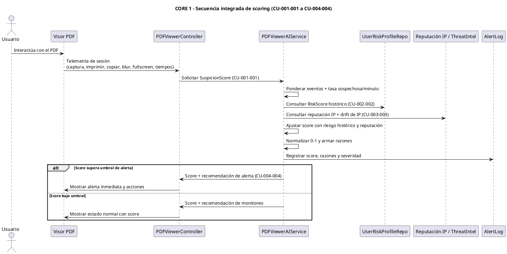

# CORE 1 — Secuencia integrada (CU-001-001 a CU-004-004)

Esta secuencia consolida los cuatro casos de uso del núcleo **IA Security Actions PDF**:
- **CU-001-001:** Evaluación de riesgo por sesión de visualización (telemetría + score base 0–1).
- **CU-002-002:** Integración con riesgo histórico del usuario para reforzar o atenuar el score de la sesión.
- **CU-003-003:** Reputación de IP y tasa de acciones sospechosas por minuto como factores adicionales.
- **CU-004-004:** Orquestación extremo a extremo desde el visor hasta la respuesta con recomendaciones.

La intención es mostrar un flujo coherente, no meramente concatenado: la misma sesión alimenta el cálculo base, luego se ajusta con riesgo histórico y reputación de red antes de decidir alertas o monitoreo.

## Diagrama de secuencia integrado

### Cómo leer el diagrama
- **Telemetría y cálculo base (CU-001-001):** El visor envía eventos de la sesión; el servicio calcula pesos y la tasa sospechosa/minuto.
- **Riesgo histórico (CU-002-002):** Se consulta el perfil del usuario para reforzar o suavizar el score de la sesión.
- **Reputación IP (CU-003-003):** Se agrega el factor de reputación y drift de IP para complementar el contexto de red.
- **Decisión extremo a extremo (CU-004-004):** El controlador responde al visor con recomendaciones diferenciadas según umbrales.

