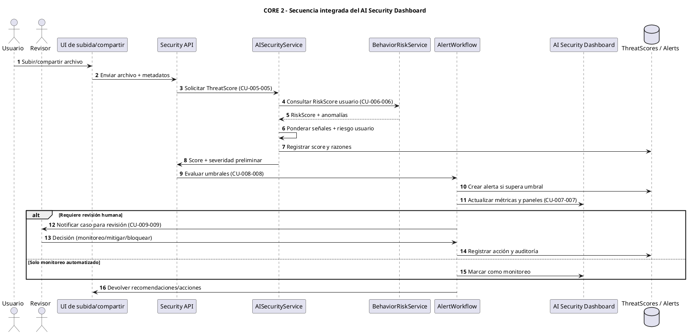

# CORE 2 — Secuencia integrada del AI Security Dashboard (CU-005-005 a CU-009-009)

Secuencia combinada para el núcleo **Gestión AI-Agent Security Dashboard**, mostrando cómo los casos de uso se encadenan:
- **CU-005-005:** Cálculo de threat score por archivo al momento de subir/compartir.
- **CU-006-006:** Riesgo de comportamiento del usuario (`RiskScore`) que alimenta la evaluación.
- **CU-007-007:** Proyección en el AI Security Dashboard de scores, alertas y métricas.
- **CU-008-008:** Aplicación de umbrales y decisiones operativas (monitoreo, revisión, cuarentena/bloqueo).
- **CU-009-009:** Flujo de revisión y bloqueo manual con auditoría.

El flujo refleja dependencias reales: el `ThreatScore` se calcula primero, se ajusta con riesgo de comportamiento, se compara con umbrales para decidir acciones y, finalmente, se proyecta en el dashboard y en la revisión humana.

## Diagrama de secuencia integrado (dashboard, umbrales y scoring)

### Cómo leer el diagrama
- **ThreatScore (CU-005-005):** El archivo se evalúa inmediatamente y el score se registra con razones.
- **Riesgo de comportamiento (CU-006-006):** El score del archivo se ajusta con el `RiskScore` del usuario para reflejar contexto.
- **Dashboard (CU-007-007):** Los resultados alimentan métricas y rankings del panel de seguridad.
- **Umbrales (CU-008-008):** Un flujo de decisiones aplica thresholds para definir si se genera alerta o solo monitoreo.
- **Revisión manual (CU-009-009):** Cuando se necesita intervención humana, el revisor decide y el sistema audita la resolución.

