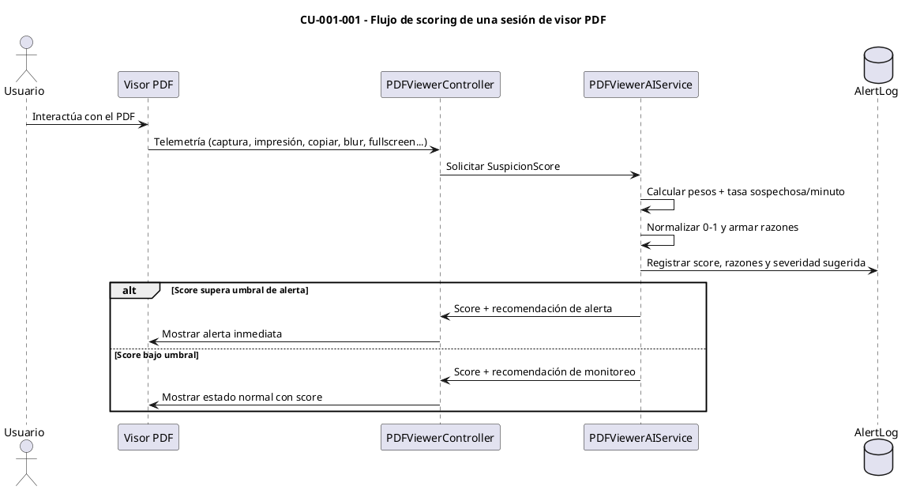
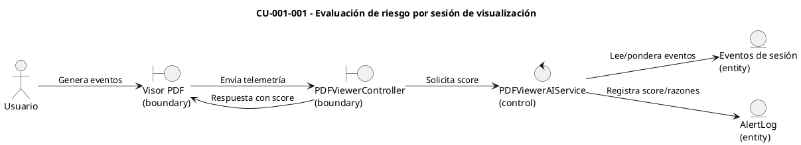

# Especificación de Caso de Uso — CU-001-001

## Encabezado del formulario
- **Código:** CU-001-001
- **Nombre:** Evaluación de riesgo por sesión de visualización
- **Referencias:** Servicio `PDFViewerAIService` y diagramas CORE 1 en `docs/AI_scoring.md`
- **Autor:** (completar)
- **Revisor:** (completar)
- **Fecha:** (completar)
- **Estado:** Validado

## Detalle del caso de uso
- **Descripción:** El sistema calcula el `SuspicionScore` (0–1) para una sesión del visor PDF combinando señales de captura, impresión, copiado, cambios rápidos de página, eventos de portapapeles, pérdida de foco/visibilidad, salidas de pantalla completa, lectura anómala y tiempo por página.
- **Actores:** Usuario (primario), Motor de Scoring (secundario)
- **Pre-condición:** El usuario tiene acceso al visor PDF y se recibe telemetría de la sesión.
- **Post-condición:** Se genera un `SuspicionScore` con razones y, si aplica, se registra la alerta correspondiente.
- **Condición:** Continuar la navegación mientras el score esté debajo de los umbrales de alerta/configuración.
- **Puntos de extensión:** Ajustes posteriores por IP/reputación y riesgo histórico (ver CU-003-003 y CU-002-002).

## Curso básico
1. El usuario abre un documento en el visor PDF.
2. El visor envía eventos de sesión (captura, impresión, copiar, cambio de página, portapapeles, blur, salir de fullscreen, tiempos de lectura) al backend.
3. El controlador solicita al `PDFViewerAIService` el cálculo de `SuspicionScore` para la sesión.
4. El servicio pondera cada evento, calcula la tasa de acciones sospechosas por minuto y el peso de lectura/tiempo por página.
5. El sistema normaliza el puntaje a una escala 0–1 y prepara las razones asociadas.
6. El servicio persiste el score y las razones en el registro de alertas/logs.
7. El backend devuelve el `SuspicionScore` y recomendaciones al visor.

## Cursos alternativos
- **A1: Eventos bloqueados por política**
  1. Si una acción (p. ej., captura de pantalla) está bloqueada por política, el sistema registra el evento como bloqueado.
  2. El peso del evento bloqueado aumenta el `SuspicionScore` antes de responder al visor.
- **A2: Umbral de alerta superado**
  1. Si el `SuspicionScore` supera el umbral de alerta configurado, se genera una alerta de seguridad con severidad alineada al score.
  2. El sistema recomienda monitoreo reforzado o revisión manual.

## Diagrama de secuencia (CU-001-001 — Evaluación de riesgo por sesión de visualización)

## Diagrama de robustez (CU-001-001)

## Pos-condición
- El sistema registra la sesión evaluada con su `SuspicionScore` y recomendaciones, quedando disponible para auditoría o revisión.
