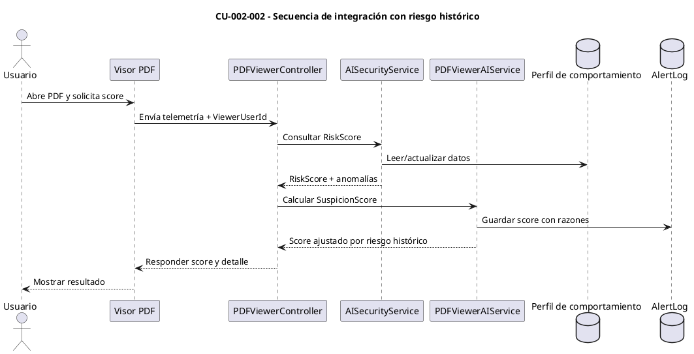
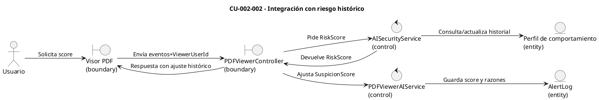

# Especificación de Caso de Uso — CU-002-002

## Encabezado del formulario
- **Código:** CU-002-002
- **Nombre:** Integración con riesgo histórico
- **Referencias:** `PDFViewerAIService.CalculateSuspicionScoreAsync` (factor de riesgo histórico) y diagramas CORE 1 en `docs/AI_scoring.md`
- **Autor:** (completar)
- **Revisor:** (completar)
- **Fecha:** (completar)
- **Estado:** Borrador

## Detalle del caso de uso
- **Descripción:** El sistema incorpora el `RiskScore` histórico del usuario y anomalías recientes de comportamiento en el cálculo del `SuspicionScore` del visor PDF para reforzar la evaluación de sesiones cuando hay patrones previos de riesgo.
- **Actores:** Usuario (primario), Motor de Scoring (secundario), Servicio de comportamiento (`AISecurityService`) (soporte)
- **Pre-condición:** Existe una sesión activa del visor PDF asociada a un usuario válido y hay historial de comportamiento accesible.
- **Post-condición:** El `SuspicionScore` incluye los aportes de riesgo histórico y anomalías de comportamiento; si procede, se registra alerta con esta información.
- **Condición:** El cálculo de riesgo histórico solo aplica cuando `ViewerUserId` está presente y el servicio de comportamiento responde con un perfil.
- **Puntos de extensión:** Bonificación por anomalías (`PdfBehaviorAnomalyBonus`) y ajuste por reputación/IP previa (ver CU-003-003).

## Curso básico
1. El visor envía al backend la solicitud de cálculo de `SuspicionScore` para la sesión en curso.
2. El backend identifica al usuario de la sesión (`ViewerUserId`).
3. El `PDFViewerAIService` invoca `AnalyzeUserBehaviorAsync` para obtener `RiskScore` y banderas de anomalía.
4. El motor de scoring añade al `SuspicionScore` el valor mínimo entre `RiskScore * PdfUserBehaviorWeight` y `PdfUserBehaviorWeight` para evitar dominancia.
5. Si el perfil marca anomalías (patrón de subidas/accesos inusuales u horarios fuera de oficina), aplica la bonificación `PdfBehaviorAnomalyBonus` al score.
6. El servicio normaliza el resultado final (0–1), guarda el puntaje y motivos, y retorna la respuesta al visor.

## Cursos alternativos
- **A1: Sin perfil de comportamiento disponible**
  1. Si `AnalyzeUserBehaviorAsync` no devuelve un perfil (usuario inexistente o sin historial), el sistema omite la contribución de riesgo histórico.
  2. Continúa con los demás factores del visor (capturas, impresiones, tasa sospechosa) y responde con el score parcial.
- **A2: Reputación/IP divergente detectada**
  1. Tras evaluar el riesgo histórico, si la IP actual difiere de la última IP registrada para el usuario, se suma `PdfIpReputationScore`.
  2. El servicio registra en las razones del score que el incremento proviene de reputación/IP.

## Diagrama de secuencia (CU-002-002)

## Diagrama de robustez (CU-002-002)

## Pos-condición
- El cálculo de la sesión queda almacenado con las razones que indican cuánto contribuyeron el `RiskScore` histórico y las anomalías al `SuspicionScore`, disponible para auditoría o revisión.
