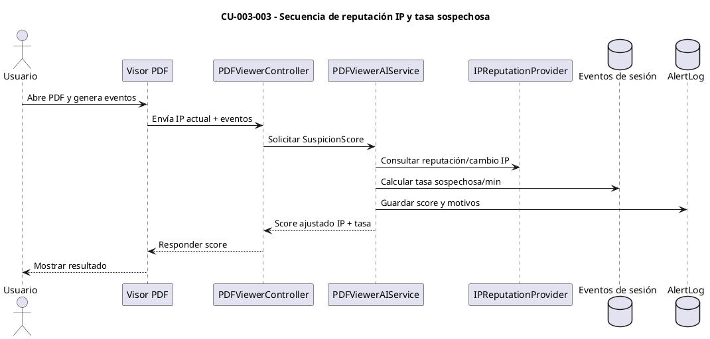
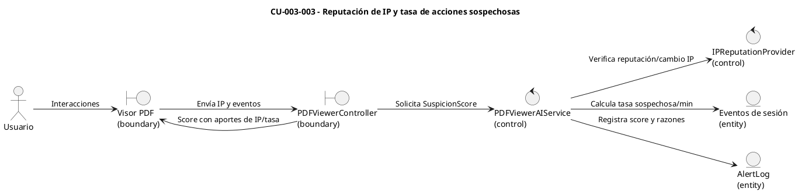

# Especificación de Caso de Uso — CU-003-003

## Encabezado del formulario
- **Código:** CU-003-003
- **Nombre:** Reputación de IP y tasa de acciones sospechosas
- **Referencias:** `PDFViewerAIService.CalculateSuspicionScoreAsync` (tasa y reputación), `AISecurityService.AnalyzeUserBehaviorAsync` (IP previa) y diagramas CORE 1 en `docs/AI_scoring.md`
- **Autor:** (completar)
- **Revisor:** (completar)
- **Fecha:** (completar)
- **Estado:** Borrador

## Detalle del caso de uso
- **Descripción:** El sistema aumenta el `SuspicionScore` de la sesión del visor PDF cuando detecta divergencia de IP respecto a accesos previos del mismo usuario y/o una tasa elevada de acciones sospechosas (capturas, copias, impresiones) por minuto, reflejando riesgo de exfiltración o automatización.
- **Actores:** Usuario (primario), Motor de Scoring (secundario), Servicio de comportamiento (`AISecurityService`) (soporte), Fuentes de reputación/IP (soporte).
- **Pre-condición:** Existe una sesión activa del visor PDF asociada a un usuario válido; se cuenta con IP actual y eventos de acciones registradas en la sesión.
- **Post-condición:** El `SuspicionScore` refleja la reputación/IP y la tasa de acciones; si se supera el umbral, se registra una alerta con estas razones.
- **Condición:** Se calcula la tasa solo cuando hay suficientes eventos temporizados y la IP previa está disponible para comparar.
- **Puntos de extensión:** Integración con riesgo histórico del usuario (ver CU-002-002) y aplicación de umbrales operativos para alertar/bloquear.

## Curso básico
1. El visor envía los eventos de la sesión (capturas, copias, impresiones) y la IP actual al backend para calcular el `SuspicionScore`.
2. El backend recupera la IP previa conocida del usuario mediante `AnalyzeUserBehaviorAsync`.
3. Si la IP actual difiere, el `PDFViewerAIService` suma `PdfIpReputationScore` al puntaje y registra la razón.
4. El servicio calcula la tasa de acciones sospechosas por minuto; si supera `SuspiciousActionsPerMinuteThreshold`, suma `SuspiciousActionsRateWeight` al `SuspicionScore`.
5. Se normaliza el score (0–1), se guardan las razones y se devuelve la respuesta al visor.

## Cursos alternativos
- **A1: Sin IP previa disponible**
  1. Si no existe IP registrada para el usuario, el sistema omite la comparación y procede solo con la tasa de acciones.
- **A2: Tasa por debajo del umbral**
  1. Si la tasa de acciones sospechosas no supera el umbral configurado, no se agrega `SuspiciousActionsRateWeight` al puntaje.
- **A3: Datos de sesión incompletos**
  1. Si faltan timestamps o conteo de eventos para calcular la tasa, el sistema reporta el score sin este factor y registra la limitación.

## Diagrama de secuencia (CU-003-003)

## Diagrama de robustez (CU-003-003)

## Pos-condición
- El cálculo queda almacenado con las razones ligadas a reputación/IP y tasa de acciones sospechosas, disponible para auditoría y revisión operativa.
