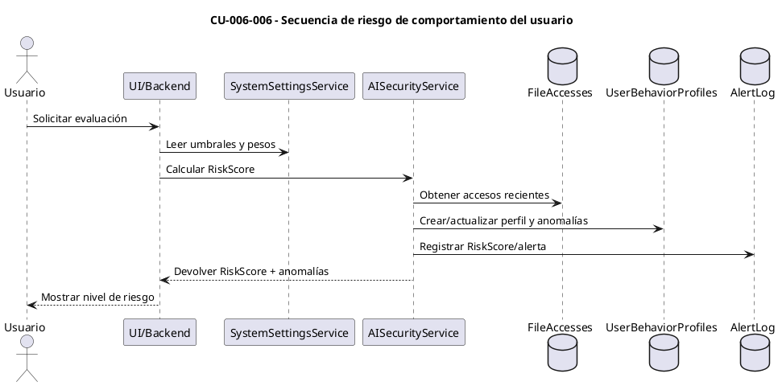
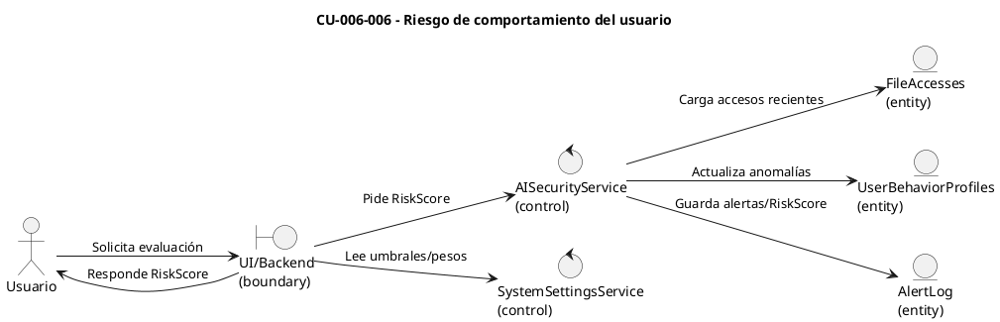

# Especificación de Caso de Uso — CU-006-006

## Encabezado del formulario
- **Código:** CU-006-006
- **Nombre:** Riesgo de comportamiento del usuario
- **Referencias:** `AISecurityService.AnalyzeUserBehaviorAsync`, perfiles en `UserBehaviorProfiles`, umbrales en `AIScoringSettings` y diagramas CORE 2 en `docs/AI_scoring.md`
- **Autor:** (completar)
- **Revisor:** (completar)
- **Fecha:** (completar)
- **Estado:** Borrador

## Detalle del caso de uso
- **Descripción:** El sistema analiza el comportamiento reciente del usuario (ubicación, dispositivo, horario, fallos de acceso, patrón y tamaño de archivos) para calcular un `RiskScore` (0–1), registrar anomalías y, si supera umbrales, generar alertas de comportamiento.
- **Actores:** Usuario autenticado (primario), Motor de análisis de comportamiento (`AISecurityService`) (secundario), Almacenamiento de perfiles de comportamiento (soporte).
- **Pre-condición:** El usuario existe, está activo y cuenta con historial mínimo de accesos/archivos; se pueden obtener zona horaria de la plataforma y configuraciones de scoring.
- **Post-condición:** Se actualiza el perfil de comportamiento con `RiskScore`, anomalías, contadores de actividad inusual y, si corresponde, se generan alertas de alto riesgo.
- **Condición:** El cálculo procede solo si el usuario no está en lista blanca AI-Agent o, de estarlo, se registra el bypass y se devuelve riesgo 0.
- **Puntos de extensión:** Integración con dashboard AI para priorizar revisiones; ajustes de pesos (`AIScoringSettings`) por industria/región; escalamiento a bloqueo manual si se repiten anomalías y el score supera el umbral alto.

## Curso básico
1. El backend recibe la solicitud para evaluar el comportamiento del usuario.
2. Se recupera la configuración de scoring y la zona horaria de la plataforma.
3. Se cargan accesos recientes (`FileAccesses`) y el perfil de comportamiento existente; si no existe, se crea/actualiza antes de continuar.
4. Se calculan señales: patrón de subidas diarias vs. promedio, tamaño promedio vs. histórico, accesos fuera de horario, deriva de ubicación/dispositivo y tasa de accesos fallidos vs. base.
5. Se suman pesos configurables (`AIScoringSettings`) según cada anomalía detectada y el conteo acumulado de actividad rara, normalizando el `RiskScore` a 0–1.
6. Se actualiza el perfil con `RiskScore`, anomalías y marcas de actividad inusual; el sistema persiste los cambios.
7. Si el `RiskScore` supera el umbral de alto riesgo, se crea una alerta de comportamiento con detalles de las anomalías para revisión.
8. El backend devuelve a la UI/consumidor el `RiskScore`, el nivel de riesgo y la lista de anomalías detectadas.

## Cursos alternativos
- **A1: Usuario en lista blanca**
  1. Si el usuario está marcado como whitelisted, el sistema registra el bypass y retorna `RiskScore` = 0 con anotación de lista blanca.
- **A2: Falta de historial suficiente**
  1. Si no existen accesos o archivos previos, se crea un perfil base y se devuelve riesgo bajo con nota de falta de datos; se evita generar alertas hasta contar con más evidencia.
- **A3: Spike de accesos fallidos**
  1. Si la tasa de accesos fallidos de los últimos 30 días supera el umbral mínimo y multiplica la tasa base, se añade la anomalía y se incrementa el `RiskScore`; si cruza el umbral alto, se dispara alerta.
- **A4: Deriva de ubicación/dispositivo**
  1. Si la última ubicación o dispositivo difiere del dominante en el historial reciente, se añade la anomalía y se ajusta el `RiskScore` según los pesos de deriva.

## Diagrama de secuencia (CU-006-006)

## Diagrama de robustez (CU-006-006)

## Pos-condición
- El perfil de comportamiento queda actualizado con `RiskScore`, anomalías y contadores de actividad rara, permitiendo alimentar el dashboard y las decisiones operativas (monitoreo, revisión o bloqueo).
