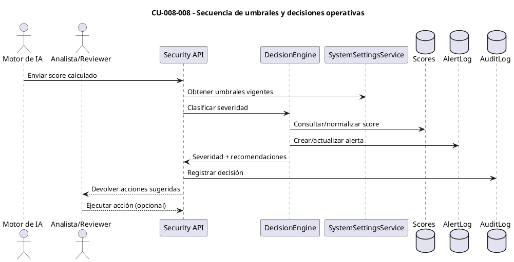
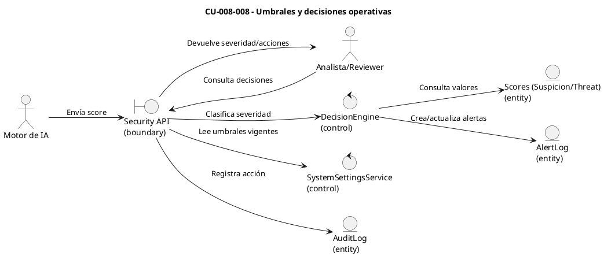

# Especificación de Caso de Uso — CU-008-008

## Encabezado del formulario
- **Código:** CU-008-008
- **Nombre:** Umbrales y decisiones operativas
- **Referencias:** Configuraciones `SuspiciousThreshold`, `HighRiskThreshold`, `RecommendationThreshold` en `AIScoringSettings`; flujos de alerta en `AISecurityService` y `PDFViewerAIService`.
- **Autor:** (completar)
- **Revisor:** (completar)
- **Fecha:** (completar)
- **Estado:** Borrador

## Detalle del caso de uso
- **Descripción:** El sistema aplica umbrales de riesgo para traducir scores (sospecha en visor PDF y threat score en archivos) en decisiones operativas: recomendar monitoreo, solicitar revisión manual, marcar alerta, o bloquear/quarentenar según severidad.
- **Actores:** Motor de IA de scoring (primario), Analista/Reviewer de seguridad (secundario), Sistemas de notificación/auditoría (soporte).
- **Pre-condición:** Se dispone de un `SuspicionScore` o `ThreatScore` calculado; los umbrales están configurados y cargados por `SystemSettingsService`.
- **Post-condición:** Se registra el nivel de riesgo categorizado (normal, sospechoso, alto), las acciones sugeridas o ejecutadas, y las alertas/auditorías correspondientes.
- **Condición:** La decisión se calcula solo si los scores están normalizados (0–1) y los umbrales están vigentes; de lo contrario, se envía advertencia para revisión manual.
- **Puntos de extensión:** Integración con reglas específicas por cliente (listas blancas/negras), automatización de bloqueo/quarantena, o escalamiento a SOAR.

## Curso básico
1. Un `SuspicionScore` (visor PDF) o `ThreatScore` (archivo) llega al servicio de seguridad.
2. El servicio compara el score con `RecommendationThreshold` para generar recomendaciones de monitoreo.
3. Si el score supera `SuspiciousThreshold`, se crea una alerta de seguridad con severidad media y se notifica al dashboard.
4. Si el score supera `HighRiskThreshold`, se marca como alto riesgo y se habilitan acciones operativas (p. ej., cuarentena de archivo o bloqueo del usuario) para el reviewer.
5. Se registra la decisión, severidad y recomendaciones en la base de datos y se responde a la UI/Dashboard.

## Cursos alternativos
- **A1: Umbrales no configurados**
  1. Si los umbrales no están cargados, el servicio devuelve advertencia y deriva a revisión manual, manteniendo el score solo como referencia.
- **A2: Acción automática habilitada**
  1. Si la política habilita acciones automáticas y el score supera `HighRiskThreshold`, el sistema aplica bloqueo/quarantena inmediata y registra la acción como automática.
- **A3: Score cercano al umbral**
  1. Si el score está dentro de un rango buffer (p. ej., ±0.05) del umbral, se agrega una nota de baja confianza y se prioriza revisión manual antes de escalar.

## Diagrama de secuencia (CU-008-008)

## Diagrama de robustez (CU-008-008)

## Pos-condición
- El caso queda documentado con el score, umbral aplicado, severidad resultante, acciones realizadas o sugeridas, y auditoría para trazabilidad y cumplimiento.
