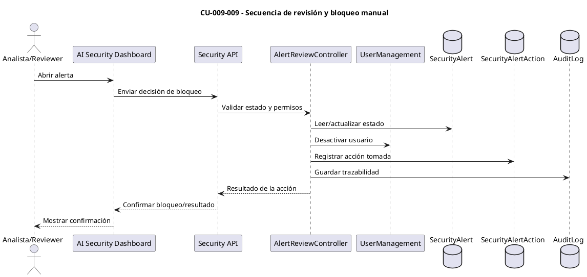
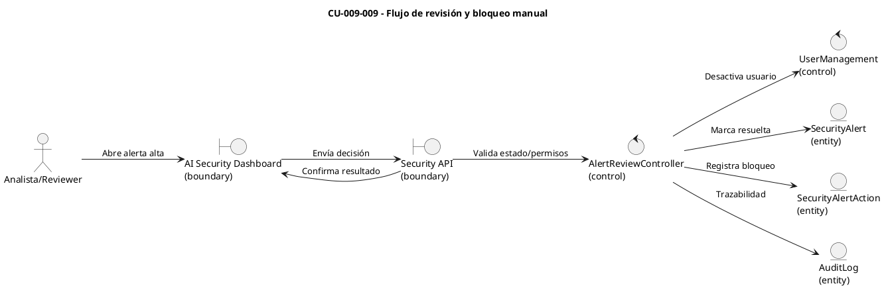

# Especificación de Caso de Uso — CU-009-009

## Encabezado del formulario
- **Código:** CU-009-009
- **Nombre:** Flujo de revisión y bloqueo manual
- **Referencias:** `AISecurityService` (creación/actualización de alertas), `AISecurityController` (`blockuser`), auditoría en `SecurityAlertAction` y `AuditLog`.
- **Autor:** (completar)
- **Revisor:** (completar)
- **Fecha:** (completar)
- **Estado:** Borrador

## Detalle del caso de uso
- **Descripción:** Permite a un analista de seguridad revisar alertas de alto riesgo y decidir el bloqueo manual de la cuenta, registrando la acción y trazabilidad completa.
- **Actores:** Analista/Reviewer de seguridad (primario), Motor de IA de scoring (secundario), Servicio de alertas/notificaciones y auditoría (soporte).
- **Pre-condición:** Existe una alerta de alto riesgo generada por los casos de scoring (PDF o archivos); el analista tiene sesión activa y permisos de revisión.
- **Post-condición:** Se registra la decisión del analista (bloqueo aprobado o rechazado), el usuario queda desactivado si procede y se persiste la auditoría.
- **Condición:** El bloqueo manual solo procede si la alerta está vigente y no ha sido resuelta; el sistema valida permisos y estado del usuario antes de aplicar la acción.
- **Puntos de extensión:** Reapertura de alertas, integración con SOAR/ticketing para seguimiento externo, reversión del bloqueo.

## Curso básico
1. El analista abre la alerta de alto riesgo en el dashboard y revisa el scoring, evidencias y recomendaciones.
2. El analista selecciona la acción "bloquear usuario" y envía la decisión desde la UI.
3. La API de seguridad recibe la acción y valida permisos, estado de la alerta y del usuario.
4. El sistema desactiva la cuenta (`IsActive = false`) y registra la acción como `SecurityAlertAction` vinculada a la alerta.
5. Se genera un registro en auditoría (`AuditLog`) con actor, timestamp, motivo y contexto de la alerta.
6. La UI confirma el bloqueo, actualiza el estado de la alerta a "cerrada" o "resuelta" y notifica a los interesados.

## Cursos alternativos
- **A1: Permisos insuficientes**
  1. Si el analista no tiene permisos de bloqueo, la API rechaza la acción y devuelve error de autorización.
- **A2: Alerta ya resuelta o usuario inactivo**
  1. Si la alerta está cerrada o el usuario ya está inactivo, se informa que no hay acción pendiente y se registra la consulta.
- **A3: Decisión de no bloquear**
  1. Si el analista opta por no bloquear, se registra la decisión y se mantienen las recomendaciones de monitoreo.

## Diagrama de secuencia (CU-009-009)

## Diagrama de robustez (CU-009-009)

## Pos-condición
- La decisión queda registrada con toda la trazabilidad (alerta, acción, auditoría) y, en caso de bloqueo, el usuario permanece desactivado hasta revisión posterior.
