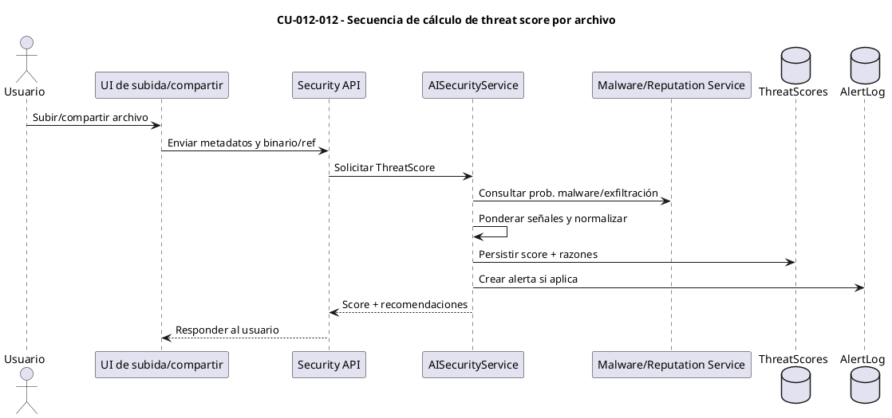
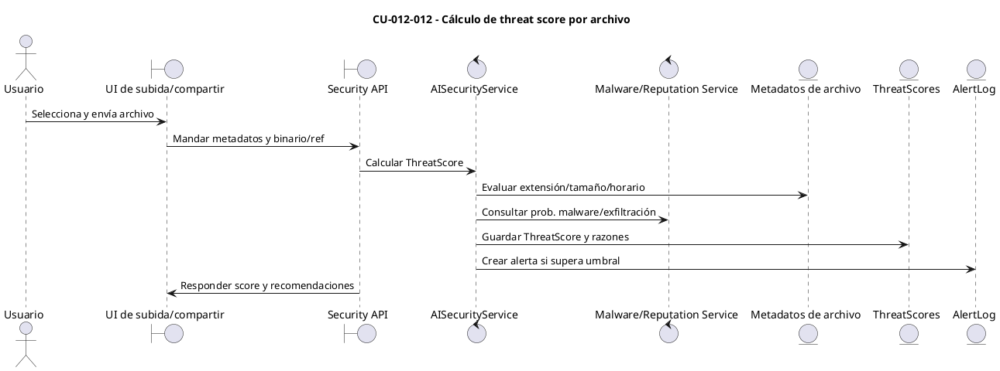

# Especificación de Caso de Uso — CU-012-012

## Encabezado del formulario
- **Código:** CU-012-012
- **Nombre:** Cálculo de threat score por archivo
- **Referencias:** `AISecurityService.AnalyzeFileAsync`, configuraciones en `AIScoringSettings` y diagramas CORE 2 en `docs/AI_scoring.md`
- **Autor:** (completar)
- **Revisor:** (completar)
- **Fecha:** (completar)
- **Estado:** Borrador

## Detalle del caso de uso
- **Descripción:** El sistema evalúa cada archivo compartido/subido, calculando un `ThreatScore` (0–1) que combina señales directas (extensión sospechosa, tamaño, horario/volumen fuera de patrón), probabilidades de malware y riesgo de exfiltración, antes de permitir su disponibilidad.
- **Actores:** Usuario que sube/ comparte (primario), Motor de Scoring de archivos (secundario), Servicio de reputación/malware (soporte).
- **Pre-condición:** El usuario tiene permisos para subir/compartir; el archivo y sus metadatos (nombre, extensión, tamaño, horario, origen) están disponibles para análisis.
- **Post-condición:** Se registra un `ThreatScore` con razones asociadas; según umbrales, se marca el archivo como sospechoso/alto riesgo y se generan alertas o recomendaciones.
- **Condición:** El cálculo procede solo si se reciben metadatos mínimos (extensión, tamaño, usuario) y el motor de reputación responde.
- **Puntos de extensión:** Integración con `RiskScore` del usuario (para acentuar riesgo de exfiltración) y políticas de cuarentena/bloqueo automático.

## Curso básico
1. El usuario inicia una subida o comparte un archivo a través de la UI.
2. La UI envía al backend los metadatos del archivo y el binario (o referencia) para análisis.
3. `AISecurityService.AnalyzeFileAsync` clasifica la extensión, tamaño y horario contra configuraciones (`AIScoringSettings`).
4. El servicio invoca análisis de malware/reputación y obtiene probabilidades de amenaza/exfiltración.
5. Se calcula el `ThreatScore` agregando pesos de señales directas y probabilidades, normalizando a 0–1.
6. El sistema guarda el score, razones y, si excede umbrales (`SuspiciousThreshold`, `HighRiskThreshold`), etiqueta el archivo como sospechoso o de alto riesgo.
7. El backend responde a la UI con el resultado y recomendaciones (p. ej., cuarentena, revisión manual, bloqueo).

## Cursos alternativos
- **A1: Extensión bloqueada por política**
  1. Si la extensión está en lista negra, se asigna el peso máximo al factor de extensión y se recomienda bloqueo inmediato.
- **A2: Probabilidad de malware alta**
  1. Si la probabilidad de malware supera el umbral de alto riesgo, el sistema eleva el `ThreatScore` al máximo y marca el archivo para cuarentena.
- **A3: Falta de datos de reputación**
  1. Si el servicio de reputación no responde, se documenta la limitación y el score se basa en señales directas; se sugiere revisión manual.

## Diagrama de secuencia (CU-012-012)

## Diagrama de robustez (CU-012-012)

## Pos-condición
- El archivo queda registrado con su `ThreatScore`, razones y estado (permitido, sospechoso, alto riesgo/cuarentena), habilitando auditoría y decisiones operativas posteriores.
