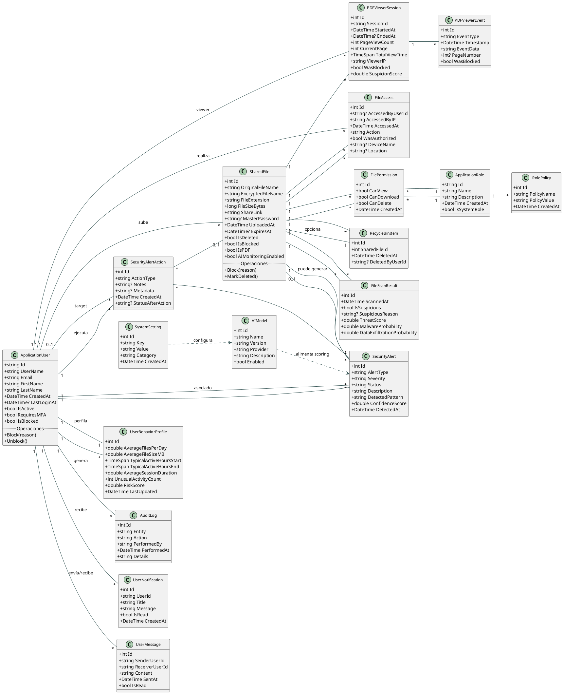

# Diagrama de clases – ConfidentialBox (vista general)

El siguiente diagrama de clases en PlantUML resume los principales objetos de dominio del proyecto, sus atributos más relevantes y las asociaciones tal como están implementadas en las entidades de `ConfidentialBox.Core` (archivos compartidos, sesiones de visor PDF, perfiles de comportamiento, alertas y flujos de seguridad).

> El diagrama prioriza las clases y relaciones de dominio más usadas por los servicios de seguridad, visor PDF y dashboard. Se incluyen atributos clave y asociaciones cardinalizadas para reflejar cómo los objetos se vinculan en la solución.
