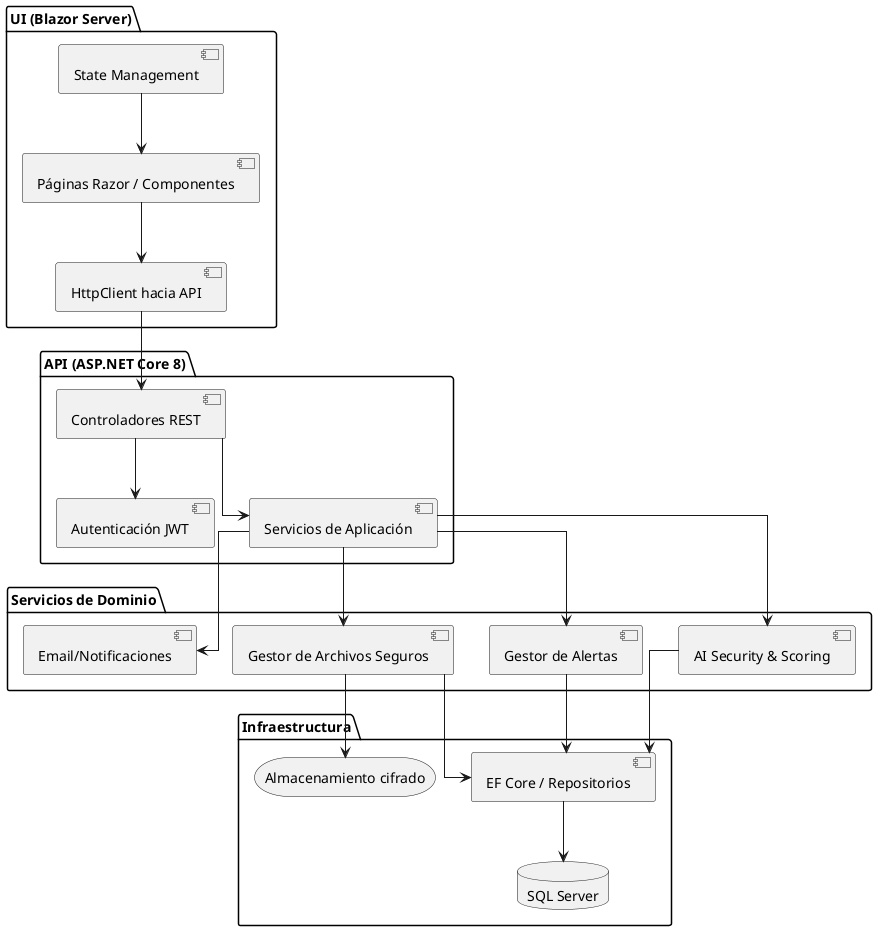

# Diagrama de Componentes (Contexto ConfidentialBox)

PlantUML con los componentes reales: UI Blazor Server, API .NET, servicios de IA/seguridad, almacenamiento y base de datos.

```plantuml
@startuml
skinparam linetype ortho
skinparam rectangleStyle rounded
skinparam defaultTextAlignment center

package "UI (Blazor Server)" {
  [Páginas Razor / Componentes]
  [State Management]
  [HttpClient hacia API]
}

package "API (ASP.NET Core 8)" {
  [Controladores REST]
  [Autenticación JWT]
  [Servicios de Aplicación]
}

package "Servicios de Dominio" {
  [AI Security & Scoring]
  [Gestor de Archivos Seguros]
  [Gestor de Alertas]
  [Email/Notificaciones]
}

package "Infraestructura" {
  [EF Core / Repositorios]
  database "SQL Server" as SqlDb
  storage "Almacenamiento cifrado" as FileStore
}

[Páginas Razor / Componentes] --> [HttpClient hacia API]
[State Management] --> [Páginas Razor / Componentes]
[HttpClient hacia API] --> [Controladores REST]

[Controladores REST] --> [Autenticación JWT]
[Controladores REST] --> [Servicios de Aplicación]

[Servicios de Aplicación] --> [AI Security & Scoring]
[Servicios de Aplicación] --> [Gestor de Archivos Seguros]
[Servicios de Aplicación] --> [Gestor de Alertas]
[Servicios de Aplicación] --> [Email/Notificaciones]

[AI Security & Scoring] --> [EF Core / Repositorios]
[Gestor de Archivos Seguros] --> [EF Core / Repositorios]
[Gestor de Alertas] --> [EF Core / Repositorios]

[EF Core / Repositorios] --> SqlDb
[Gestor de Archivos Seguros] --> FileStore
@enduml
```
