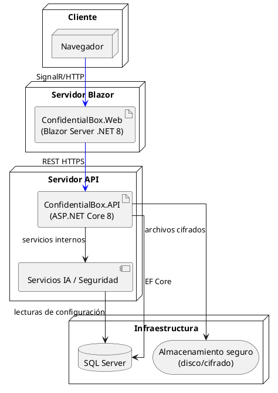

# Diagrama de Despliegue (Contexto ConfidentialBox)

PlantUML del despliegue real usando Blazor Server (.NET 8), API .NET 8 y SQL Server con almacenamiento de archivos cifrados.

```plantuml
@startuml
skinparam linetype ortho
skinparam defaultTextAlignment center

node "Cliente" {
  node "Navegador" as Browser
}

node "Servidor Blazor" as BlazorServer {
  artifact "ConfidentialBox.Web\n(Blazor Server .NET 8)" as BlazorApp
}

node "Servidor API" as ApiServer {
  artifact "ConfidentialBox.API\n(ASP.NET Core 8)" as Api
  component "Servicios IA / Seguridad" as AiServices
}

node "Infraestructura" {
  database "SQL Server" as SqlDb
  storage "Almacenamiento seguro\n(disco/cifrado)" as FileStorage
}

Browser -[#blue]-> BlazorApp : SignalR/HTTP
BlazorApp -[#blue]-> Api : REST HTTPS
Api --> AiServices : servicios internos
Api --> SqlDb : EF Core
Api --> FileStorage : archivos cifrados
AiServices --> SqlDb : lecturas de configuración
@enduml
```
