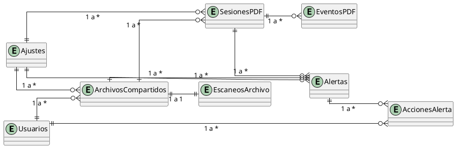

# Diagrama Entidad-Relación (ConfidentialBox)

```plantuml
@startuml
left to right direction
skinparam linetype ortho
skinparam entityStyle rectangle
skinparam defaultTextAlignment center

entity "Usuarios" as Usuarios
entity "ArchivosCompartidos" as Archivos
entity "EscaneosArchivo" as Escaneos
entity "SesionesPDF" as Sesiones
entity "EventosPDF" as Eventos
entity "Alertas" as Alertas
entity "AccionesAlerta" as Acciones
entity "Ajustes" as Ajustes

Usuarios ||--o{ Archivos : "1 a *"
Archivos ||--|| Escaneos : "1 a 1"
Archivos ||--o{ Sesiones : "1 a *"
Sesiones ||--o{ Eventos : "1 a *"
Archivos ||--o{ Alertas : "1 a *"
Sesiones ||--o{ Alertas : "1 a *"
Alertas ||--o{ Acciones : "1 a *"
Usuarios ||--o{ Acciones : "1 a *"
Ajustes ||--o{ Alertas : "1 a *"
Ajustes ||--o{ Archivos : "1 a *"
Ajustes ||--o{ Sesiones : "1 a *"
@enduml
```
